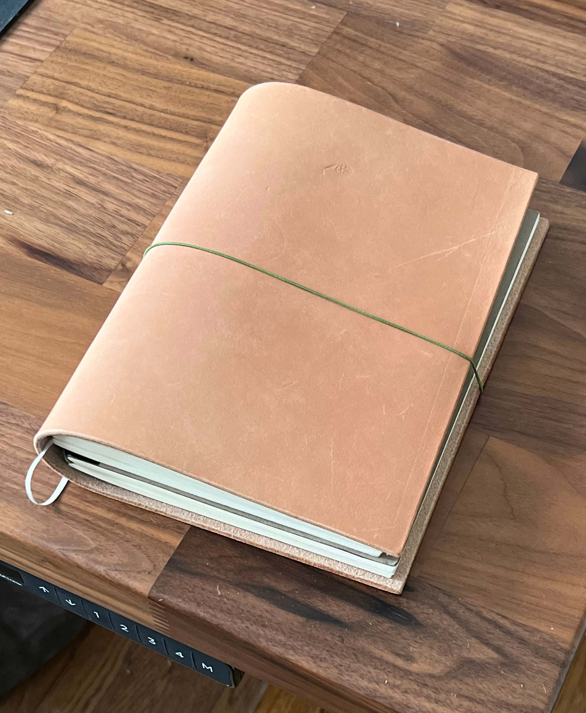

# kcl-creations

This repository has `.kcl` files modeling leather creations.

Check out the [kcl](https://zoo.dev/docs/kcl) language and [modeling application](https://zoo.dev/modeling-app) at [Zoo](https://zoo.dev/)

The following designs can be 3D printed to have templates to mark and cut on your leather panels.

## A5 Leather Notebook

## Passport Wallet

